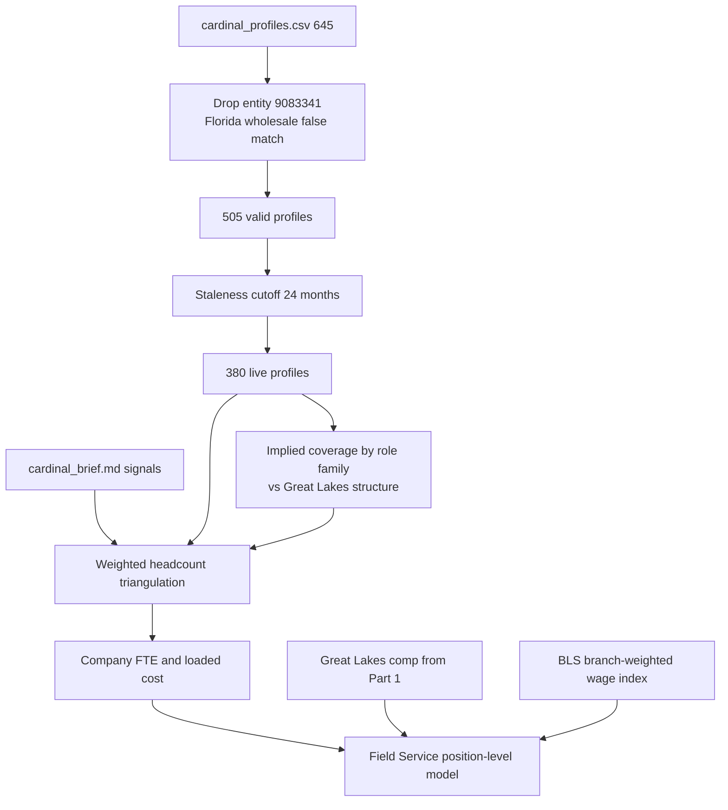

= Part 2 — Cardinal Outside-In Workforce Simulation

## What the research already established

These numbers are computed, not assumed, and the memo will be built on them.

**The alternative-data extract contains a false match.** Entity `9083341` "Cardinal Comfort Solutions" is 140 profiles, every one in Florida (Tampa 45, Fort Myers 37, Orlando 32, Lakeland 26), described as HVAC equipment wholesale distribution at `cardinalsupplyco.com`. Different name, industry, state and domain. Cardinal operates six branches in Ohio and Kentucky. Excluding it is the single highest-impact step in the whole exercise: it removes 22% of the extract before any analysis. The remaining 505 profiles across entities `4471023` and `6120887` map exactly onto the six known branches (Cincinnati 140, Mason 38, Florence KY 61, Columbus 56, Dayton 47, Lexington 58) plus Louisville 105, which is the separately-branded subsidiary. No cross-entity duplicates exist (zero overlapping title/location/start-date keys) and no date anomalies.

**"Current" profiles are not current.** `profile_last_updated` runs 2018 to 2026: 125 profiles were last touched in 2022 or earlier, none in 2023, then 40 in 2024, 177 in 2025, 163 in 2026. A 24-month staleness cutoff at 2024-09-01 leaves **380 live profiles** against a press release claim of roughly 400 employees.

**Coverage is role-dependent, and that is the central methodological point.** Live profiles show 74 Sales (19.5%) against 125 field roles (33%). Northstar's actual mix is Sales 7.2% and field 65%. Field technicians do not maintain professional profiles; sales and management do. The naive read (505 profiles, or even 380, taken as a headcount and a mix) is wrong in both directions at once, and the two errors partly cancel, which is what makes it dangerous.

**The provider's salary estimate is unusable at role grain.** Only 147 of 505 profiles carry `salary_est_base`, and the ladder is inverted: Apprentice Technician $59,500 above Service Technician $58,250 above Senior Service Technician $55,000; Installer $54,500 above Lead Installer $50,000. In aggregate it is roughly right (Service Technician $58,250 against Great Lakes' actual $59,467), so it survives as a sanity check and nothing more.

**Great Lakes is a near-perfect comp.** 392 employees, HVAC plus plumbing, against Cardinal at roughly 400, HVAC plus plumbing. Its mix from [output/workforce_model.csv](output/workforce_model.csv) is Field Install 27.0%, Field Service 36.0%, Field Leadership 5.6%, Customer Care 14.0%, Warehouse and Fleet 7.4%, Sales 5.9%, Finance 3.1%, IT 0.8%, Executive 0.3%. Two caveats to handle explicitly: Great Lakes records no role levels (all `Unspecified`), so the level ladder comes from Bayside instead (HVAC Service Tech I/II/III at 22/60/18 percent, HVAC Installer I/II/Lead at 23/61/16); and Great Lakes carries almost no G&A because it consumes Northstar Corporate shared services, whereas standalone Cardinal must carry its own.

**Geography is a second-order effect.** BLS OEWS May 2025 medians for SOC 49-9021 are Cincinnati $62,240, Dayton $62,500, Columbus $64,440, Lexington-Fayette $60,280, Louisville/Jefferson $58,930, against Michigan statewide $60,850. Branch-weighted, Cardinal sits near $61,600, an index of roughly **1.01** against the Great Lakes comp. The Michigan instinct was right, and the memo can say so with a citation rather than an assertion.

**The back-test already works, and it already caught a trap.** Leave-one-out across the four operating companies, predicting each one's field headcount from the mean field share of the other three given only total headcount, lands within **2.5% mean absolute error** (Bayside +1.5%, Great Lakes 0.0%, Pinnacle +3.5%, Redwood -4.9%, max 4.9%). By family the error widens: Install 7.2%, Service 3.8%, Leadership 10.1%. The first run included Northstar Corporate in the comparison set and biased every field estimate down about 25% — a live demonstration of why the review checklist in section 3 leads with comp-set construction.

## Build

### `src/build_cardinal.py`

Stages, each writing an auditable output:

- **Entity resolution and staleness**, emitting `output/cardinal_profile_base.csv` with an `excluded_reason` column so every dropped profile is traceable rather than silently missing.
- **Coverage diagnostic**, emitting `output/cardinal_coverage_by_role.csv`: live profiles per role family against the Great Lakes structural expectation, producing the implied coverage factor. Sales will come out above 100%, which is the flag that the extract over-represents it.
- **Headcount triangulation**, emitting `output/cardinal_headcount_triangulation.csv`: one row per signal with its value, derived headcount, weight and rationale. Press release roughly 400 at the heaviest weight (most recent, and the acquirer has LOI-level access), live profiles 380, revenue per employee on 2026E revenue of roughly $95M against the $200-250K benchmark, the 260-vehicle fleet signal divided by the field-technician share, the September 2025 trade profile grown forward, and the directory range as corroboration only. These converge near **405 employees and roughly 400 FTE**.
- **Cost build**, both bases as agreed: standalone Cardinal as the headline, then a pro-forma line applying Northstar's load factors and absorbing shared services, since that delta is the synergy read the deal team will want.
- **Field Service model**, emitting `output/cardinal_field_service_model.csv` with the exact column contract of [output/workforce_model.csv](output/workforce_model.csv). Roughly 108 Install, 144 Service and 22 Leadership positions, cross-checked against the 260-vehicle fleet signal and against the 18 to 22 field leaders the alt data independently shows (Field Supervisor 6, Service Manager 7, Install Manager 5 live, plus Branch Managers) — corroboration that works precisely because supervisory roles are the ones alt data covers well.
- **Sensitivity**, emitting `output/cardinal_sensitivity.csv`: a tornado over total headcount, field share, trade split, wage index and load factor, so the memo can state which assumption actually moves the answer.

### `config/cardinal_assumptions.csv` and `config/cardinal_title_map.csv`

Every tunable input in one editable file — staleness months, signal weights, field shares, HVAC/plumbing split, wage index, load factors — so a reviewer can flex an assumption without reading code. The title map crosswalks the 54 raw provider titles to Part 1 standardized roles, keeping Cardinal and Northstar on one taxonomy.

### `src/backtest_structure.py`

The leave-one-out back-test as a standalone script writing `output/backtest_leave_one_out.csv`, including the Northstar Corporate contamination case as an explicit second scenario, because the failure is more instructive than the success.

### `src/memo_to_docx.py`

Needs markdown table support added; it currently handles only headings, paragraphs and inline formatting. Part 2 runs 3-5 pages, so tables are affordable this time, unlike Part 1.

## Memo: `docs/cardinal_methodology_memo.md` (3-5 pages, plus `.docx`)

**Section 1 — Company-wide FTE and loaded cost.** The triangulation table with explicit weights, landing on roughly 400 FTE and a standalone fully loaded cost near $34M against a benchmark cross-check of $33-38M, with the pro-forma delta noted. Confidence stated separately for headcount (tighter, multiple independent signals converge) and cost (wider, since it inherits headcount error and adds pay-structure error).

**Section 2 — Field Service end to end.** Each step naming its source and what that source uniquely contributes: total headcount from triangulation, field share from Great Lakes, level ladder from Bayside, trade split blended from Great Lakes actuals and the Cardinal alt-data title mix, pay from Great Lakes medians times the BLS index, load factors from the Part 1 P&L. The fleet and supervisor cross-checks land here.

**Section 3 — Trust and review.** The executed back-test with its 2.5% measured error and the wider 7-10% family-level error; the internal consistency checks (revenue per FTE, labor as a percentage of revenue, vehicles per technician, supervisor span); the sensitivity result; pre-committed falsifiers stated before diligence opens; and a review checklist for a teammate's model that leads with entity resolution and comp-set construction, since those are where this exercise's two largest errors actually lived.

## Risks to manage

The sales-count anomaly needs a stated position rather than a quiet smoothing — either Cardinal genuinely runs a sales-heavy in-home model or the extract over-retains sales profiles, and the memo should say which reading it takes and what would settle it. The Louisville subsidiary also needs a clear treatment: 105 profiles sit there against roughly 60 employees at acquisition in March 2024, so it has either grown or accumulated stale records, and whether the press release's "approximately 400" includes it is genuinely ambiguous.